# HTML & CSS Assignment

**Name:** Akerke Berdakul  
**Group:** IT-2503

---

## Part 1. Introduction to HTML

### Step 0. Create a New HTML File

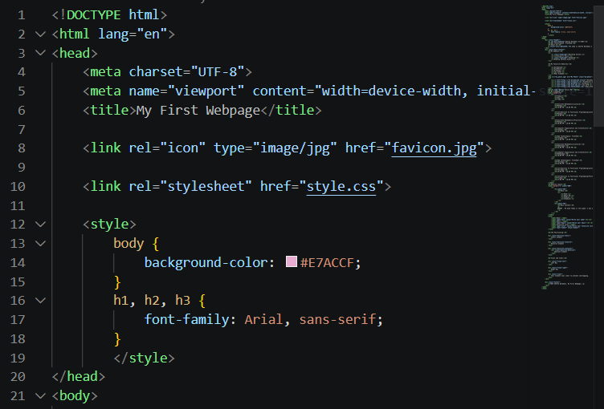

---

### Step 1. Structure Text Using HTML Tags

Added headings from `<h1>` to `<h3>` containing my name, course, and "About Me". I also added a paragraph describing myself.

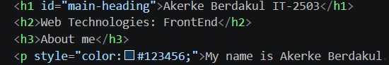

---

### Step 2. HTML Lists

Created an ordered list of my hobbies using `<ol>` and an unordered list of my favorite websites using `<ul>`.

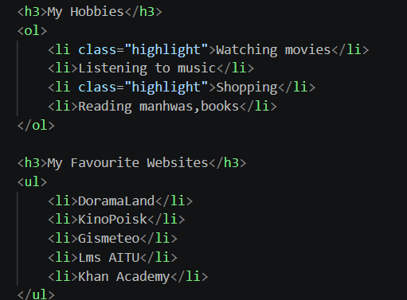
---

### Step 3. Images and Links

Added my photo using the `` tag and created clickable links to Google, YouTube, and GitHub using `<a>` tags.
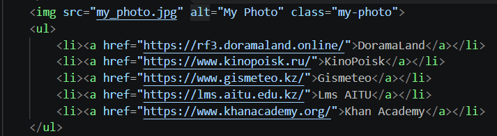

---

### Step 4. HTML Buttons

Added a button with the text "Click Me".

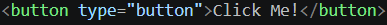

---

## Part 2. Intermediate HTML

### Step 5. Tables

Created a weekly class schedule using an HTML table with three columns: Subject, Day, and Time.

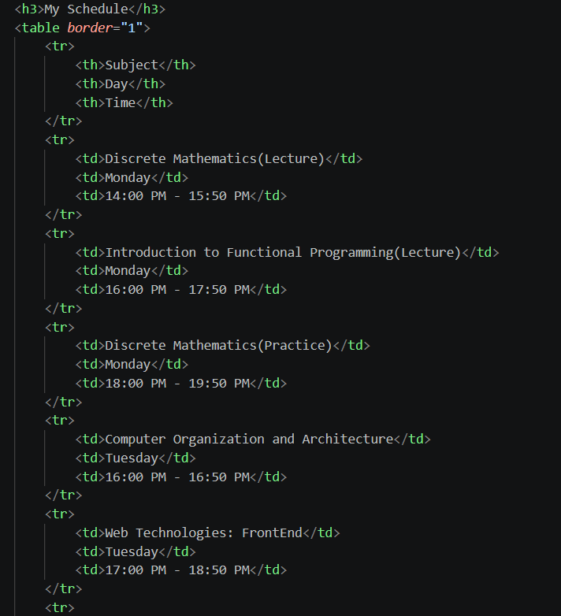

---

### Step 6. Using Tables for Layout

Created an optional two-column layout using a table. The left column contains a menu and the right column contains the main content.

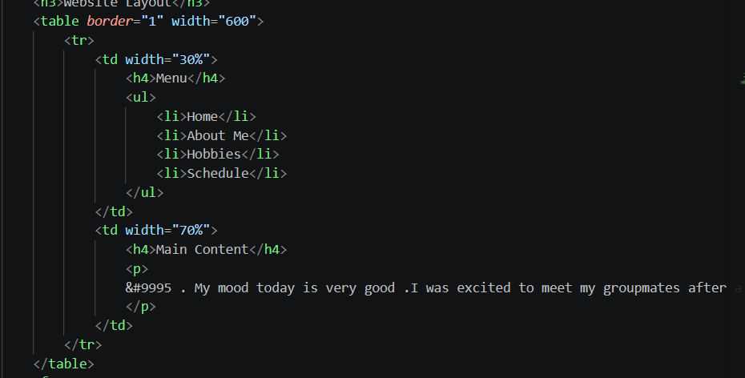

---

### Step 7. Typing Emojis

Added a paragraph describing my mood and included at least three emojis.

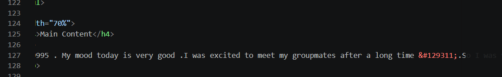

---

### Step 8. HTML Forms

Created a form containing Name, Email, Favorite Color, and a Submit button.

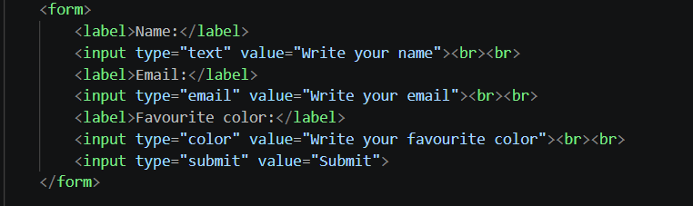

---

# Part 3. Introduction to CSS

### Step 9. Introduction to CSS

Added CSS styling to my existing HTML webpage to improve its appearance and layout.
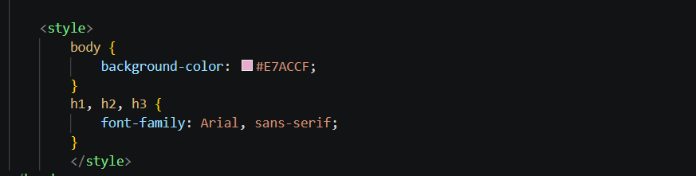

### Step 10. Inline CSS

Used inline CSS to change the color of one paragraph.
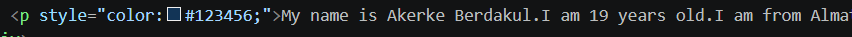

---

### Step 11. Internal CSS

Added CSS rules inside the `<style>` element in the `<head>` section. The rules were used to change the background color and heading font.

---

### Step 12. External CSS

Created a separate `style.css` file and connected it to `index.html` using the `<link>` element.
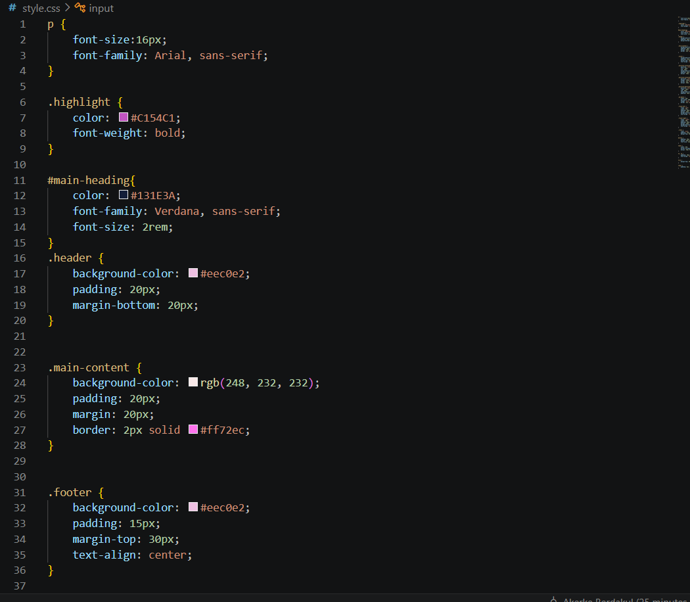

---

### Step 13. CSS Syntax and Selectors

Used element selectors, class selectors, and ID selectors to apply different styles to different elements.

---

### Step 14. Classes vs. IDs

Created the `.highlight` class for styling multiple elements and the `#main-heading` ID for styling the main `<h1>` heading.
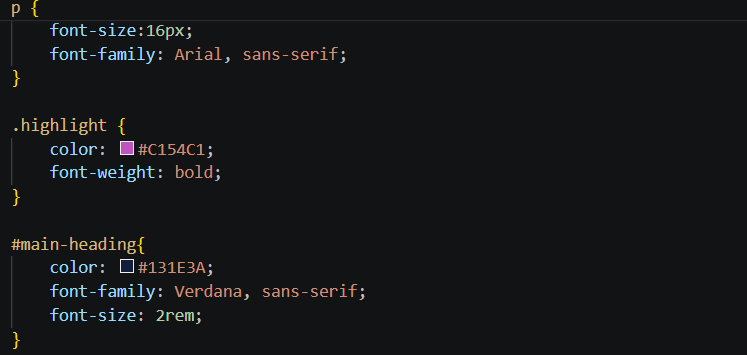

---

# Part 4. Intermediate CSS

### Step 15. Favicons

Added a favicon to the webpage using the `favicon.png` image.

---

### Step 16. HTML Divs

Used `
` elements to organize the webpage into header, main content, and footer sections. Added background colors and padding to these sections.
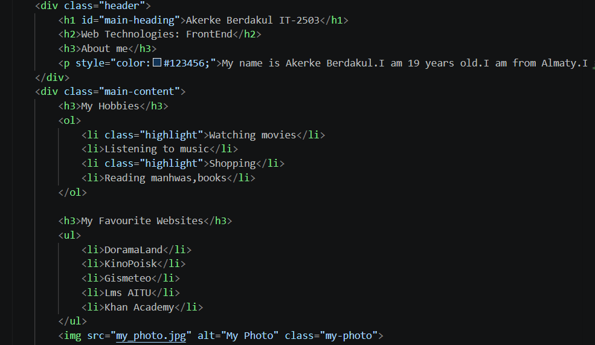
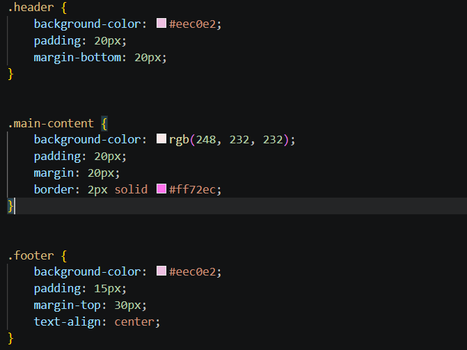

---

### Step 17. Box Model

Applied borders, margins, and padding to different elements to demonstrate the CSS box model.

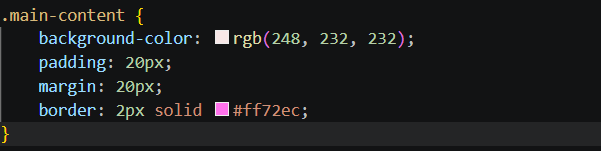

---

### Step 18. CSS Positioning

Created elements using static, relative, and absolute positioning.
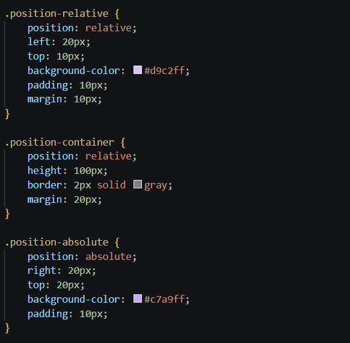
---

### Step 19. CSS Sizing

Used different CSS units, including `px`, `%`, `em`, and `rem`, to control the sizes of elements.
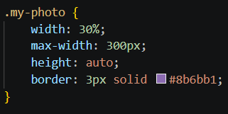

---

### Step 20. Float and Clear

Created two boxes using `float: left` and `float: right`. Used `clear: both` to prevent layout problems.
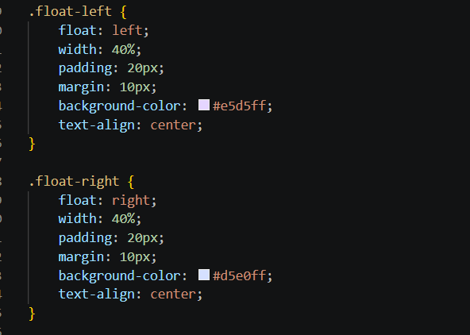
---

## Step 21. Publish Your First Website

Published the website using GitHub Pages.

[My First Webpage](https://github.com/akerkeberdakul/home.html/blame/main/index.html)

# Work Process Summary

During this assignment, I created my first webpage using HTML and gradually improved it with CSS. First, I created the basic HTML structure and added headings, paragraphs, lists, images, links, buttons, tables, emojis, and a form.

Next, I learned how to apply CSS using inline, internal, and external styles. I practiced different CSS selectors, classes, IDs, positioning, sizing, the box model, floats, and clear properties. I also organized the webpage using `
` elements and added a favicon.

Finally, I organized all project files in a GitHub repository and published the webpage using GitHub Pages. This assignment helped me understand the basic structure of a website and how HTML and CSS work together to create and style web pages.